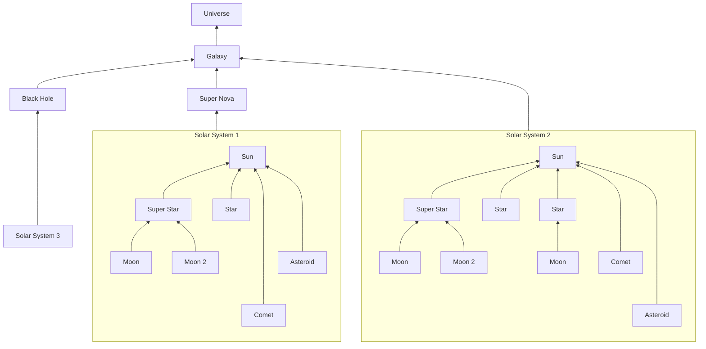
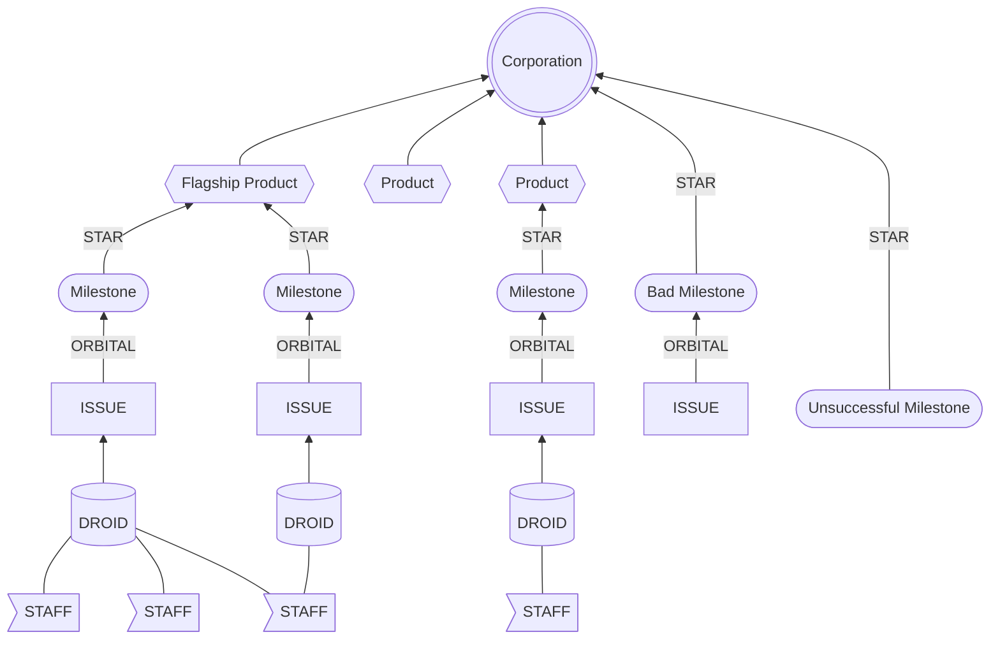

## Welcome to World Enterprise!
https://worldenterprise.com

Business Incubator that helps build Worlds. World Enterprise (WE) has over 20 years of business experience growing companies. 
- **WE Dream**
- **WE Build**
- **WE Grow**

## UNIVERSAL BUSINESS FRAMEWORK (UBF)
We use a scientific method known as UBF to orchestrate business incubation.  We help ideas grow into products, products to companies, and companies to enterprises with over 20 years experience in the industry using our approach.

We are working in collaboration with INSTAR Lab Inc, a Research Institute known for building strong Scientific Methods.

Read the below files to understand the UBF in more detail.
- [United Business Framework](https://github.com/WorldEnterpriseGroup/.github/blob/gh-pages/Frameworks/UBF.md)
- [STAR Framework](https://github.com/WorldEnterpriseGroup/.github/blob/gh-pages/Frameworks/STAR.md)
- [ORBITAL Framework](https://github.com/WorldEnterpriseGroup/.github/blob/gh-pages/Frameworks/ORBITAL.md)
- [DROID Framework](https://github.com/WorldEnterpriseGroup/.github/blob/gh-pages/Frameworks/DROID.md)

## UNIVERSE STRUCTURE

## CORPORATE SOLAR SYSTEM STRUCTURE

# About World Enterprise
### **GALAXY:**
The NAICS code for World Enterprise, a business incubator, would be 813910. This code is specifically for "Business Associations" and includes organizations that support entrepreneurs and small businesses, such as business incubators. 

### **BLACK HOLE:**
The largest business incubator and accelerator in the USA that is in the NAICS 813910 and supports entrepreneurs and small businesses is the National Business Incubation Association (NBIA).

### **SUPER NOVA:**
A large event that can be felt across the entire industry.

### **SOLAR SYSTEM:**
Companies in a business galaxy are organized by their holding companies, known as the Solar System. These solar systems are classified based on their size, market share, and SIC Codes.
