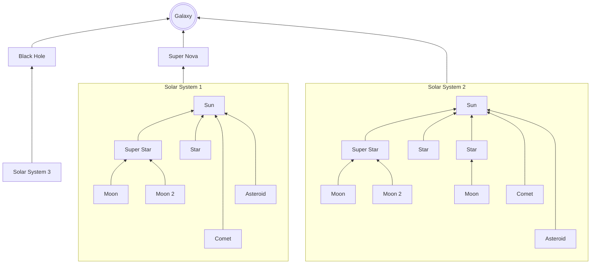
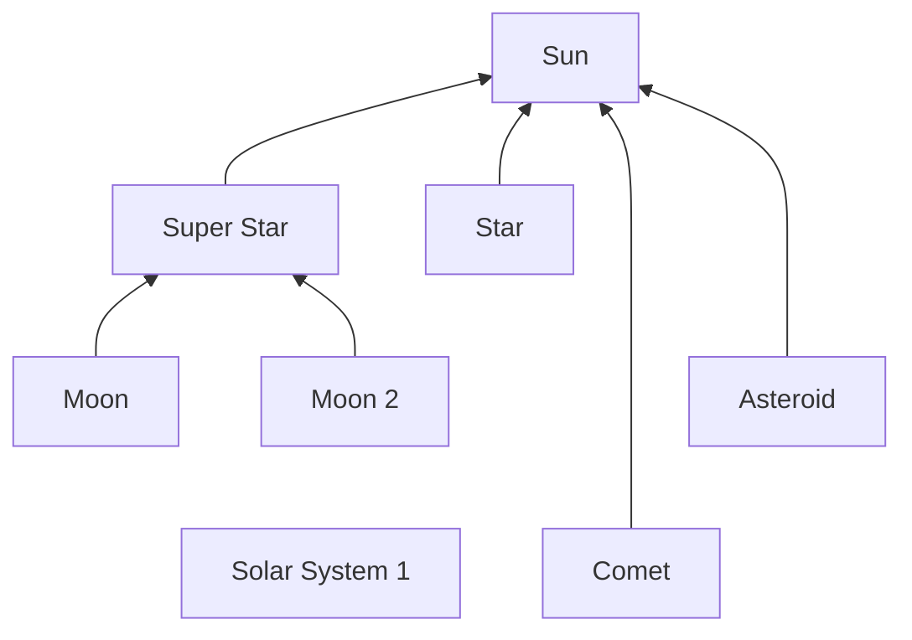
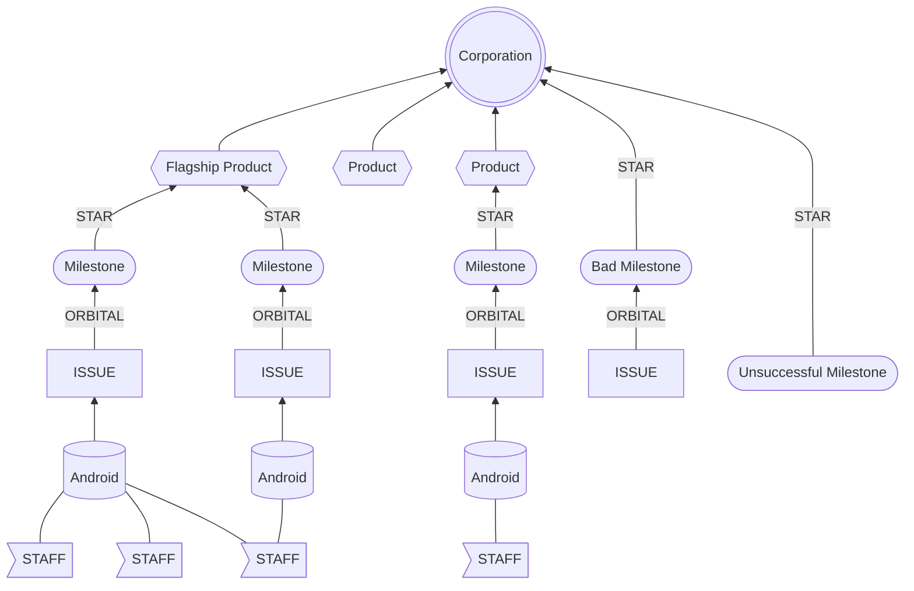

## Welcome to World Enterprise!
[World Enterprise](https://worldenterprise.com)

World Enterprise (WE) is a premier business incubator dedicated to transforming innovative ideas into thriving companies. With over 20 years of experience, we specialize in nurturing projects from conception to market dominance.

- **WE Dream**
- **WE Build**
- **WE Grow**

## WORLD ENTERPRISE FRAMEWORK (WEF)
At World Enterprise, we utilize the Universal Business Framework (UBF) and the ANDROID Ops Framework to orchestrate business incubation. Our scientific approach helps ideas evolve into products, products into companies, and companies into industry leaders.

### Our Collaboration
We collaborate with INSTAR Lab Inc., a renowned research institute, to leverage cutting-edge scientific methods in our incubation process.

### Learn More
Explore our frameworks to understand the methodologies that drive our success:
- [Universal Business Framework](https://github.com/WorldEnterpriseGroup/.github/blob/gh-pages/Frameworks/UBF.md)
- [Galactic Enterprise Framework](https://github.com/WorldEnterpriseGroup/.github/blob/gh-pages/Frameworks/UBF.md)
- [World Enterprise Framework](https://github.com/WorldEnterpriseGroup/.github/blob/gh-pages/Frameworks/UBF.md)
- [STAR Framework](https://github.com/WorldEnterpriseGroup/.github/blob/gh-pages/Frameworks/STAR.md)
- [ORBITAL Framework](https://github.com/WorldEnterpriseGroup/.github/blob/gh-pages/Frameworks/ORBITAL.md)
- [ANDROID Framework](https://github.com/WorldEnterpriseGroup/.github/blob/gh-pages/Frameworks/Android.md)

## GALACTIC STRUCTURE

## CORPORATE SOLAR SYSTEM STRUCTURE

# About World Enterprise

### **GALAXY:**
World Enterprise operates within the NAICS code 813910, which encompasses "Business Associations" that support entrepreneurs and small businesses, including business incubators.

### **BLACK HOLE:**
The National Business Incubation Association (NBIA) is the largest business incubator and accelerator in the USA, supporting entrepreneurs and small businesses under NAICS 813910.

### **SUPER NOVA:**
A Super Nova represents a significant industry event, such as major mergers, acquisitions, or technological breakthroughs, that can impact the entire industry.

### **SOLAR SYSTEM:**
Companies within a business galaxy are organized by their holding companies, known as Solar Systems. These systems are classified based on size, market share, and SIC Codes.

---

At World Enterprise, we are committed to launching droids (projects) that evolve into worlds (companies) or join existing worlds, creating a dynamic and thriving business ecosystem. Our frameworks and methodologies ensure that each project is nurtured to its full potential, driving innovation and growth across industries.
